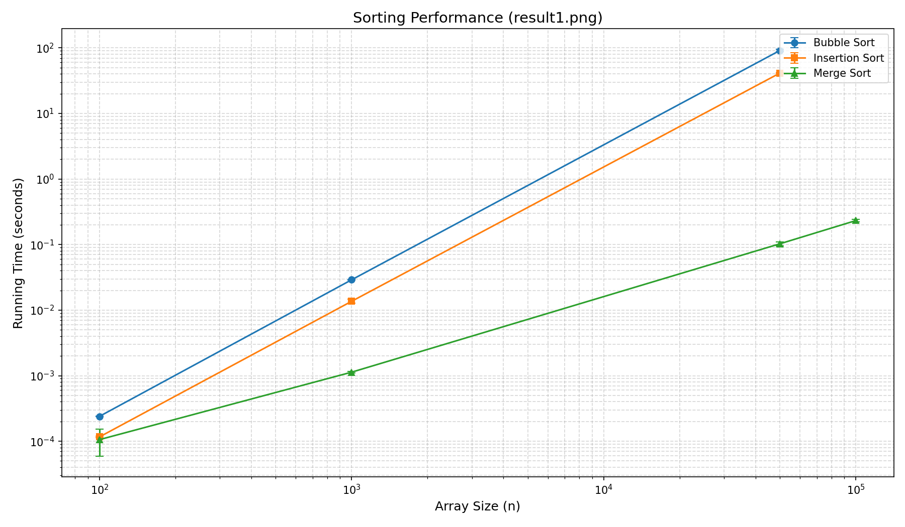
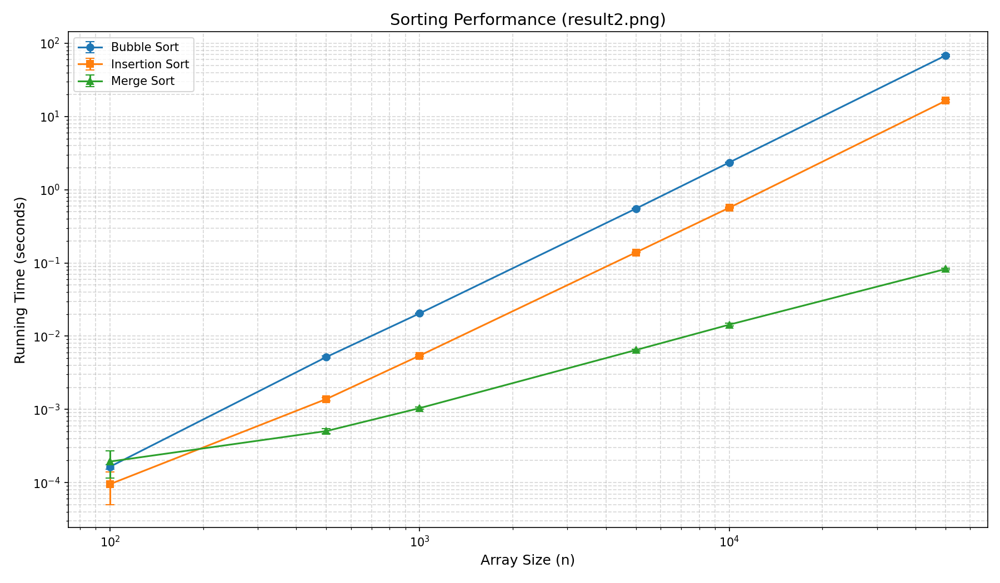

# Sorting_Assignment
**Student Names:** Omer Sharon (322532490)
and Yonathan Idel (322706698)

## Selected Algorithms
* Bubble Sort
* Insertion Sort
* Merge Sort

---

## Part B: Random Arrays

### Explanation
Bubble Sort and Insertion Sort show quadratic growth (O(n^2)), making them very slow as the size increases. Merge Sort remains flat because its O(n log n) complexity is much more efficient for large data.

---

## Part C: Nearly Sorted Arrays

### Explanation
Insertion Sort became much faster here. This is because it only needs to fix the small percentage of "noisy" elements, reaching near O(n) performance. Bubble Sort and Merge Sort did not see such a dramatic change.
